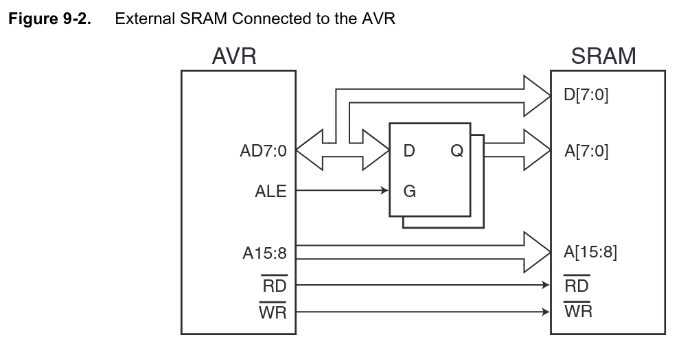
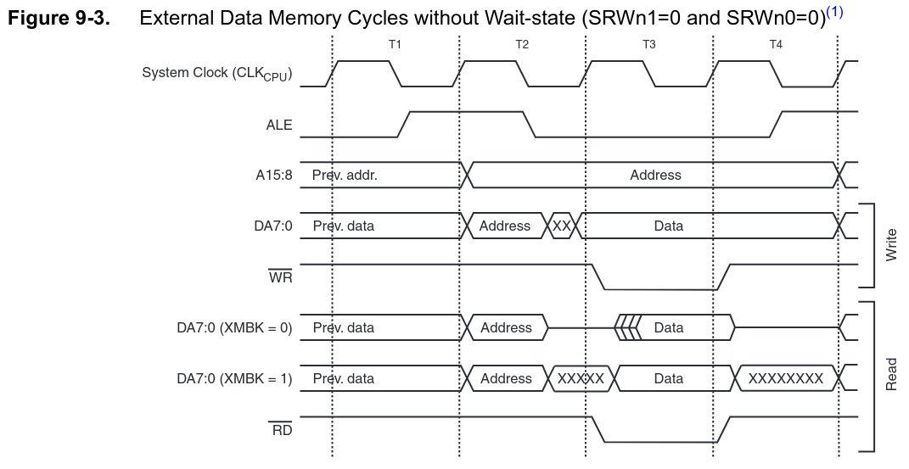
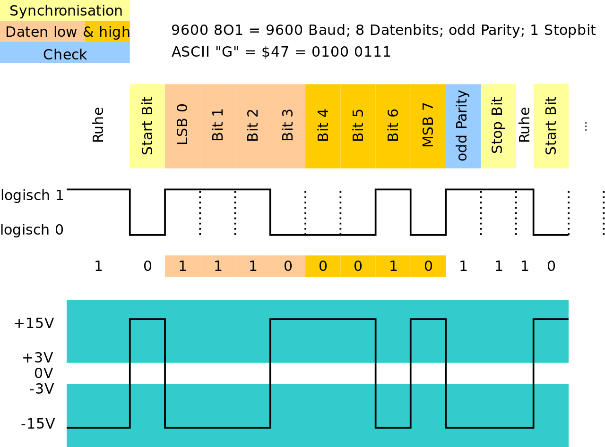

<!--
author:   Sebastian Zug, Karl Fessel & Andrè Dietrich
email:    sebastian.zug@informatik.tu-freiberg.de

version:  1.0.0
language: de
narrator: Deutsch Female

import:  https://raw.githubusercontent.com/liascript-templates/plantUML/master/README.md
         https://github.com/LiaTemplates/AVR8js/main/README.md
         https://github.com/LiaTemplates/Pyodide

icon: https://upload.wikimedia.org/wikipedia/commons/d/de/Logo_TU_Bergakademie_Freiberg.svg
-->


[](https://liascript.github.io/course/?https://github.com/TUBAF-IfI-LiaScript/VL_DigitaleSysteme/main/lectures/06_Kommunikation.md#1)


# Kommunkation

| Parameter                | Kursinformationen                                                                                                                                                                    |
| ------------------------ | ------------------------------------------------------------------------------------------------------------------------------------------------------------------------------------ |
| **Veranstaltung:**       | `Vorlesung Digitale Systeme`                                                                                                                                                      |
| **Semester**             | `Sommersemester 2021`                                                                                                                                                                |
| **Hochschule:**          | `Technische Universität Freiberg`                                                                                                                                                    |
| **Inhalte:**             | `Grundlegende Kommunkationskonzepte`                                                                                            |
| **Link auf den GitHub:** | [https://github.com/TUBAF-IfI-LiaScript/VL_DigitaleSysteme/blob/main/lectures/06_Kommunikation.md](https://github.com/TUBAF-IfI-LiaScript/VL_DigitaleSysteme/blob/main/lectures/06_Kommunikation.md) |
| **Autoren**              | @author                                                                                                                                                                              |


---

## Ausgangspunkt

                    {{0-1}}
********************************************************************************

Für die Organisation von Multiprocessor-Anwendungen aber auch das Debugging und die Nutzerinteraktion benötigen wir Kommunkationskonzepte, die den Datenaustausch ermöglichen.

```cpp       uart.cpp
int thisByte = 33;

void setup() {
  Serial.begin(9600);
  Serial.print("[Debug] Wert von thisByte: ");
  Serial.println(thisByte);
}

void loop() {
}
```
@AVR8js.sketch

Im Rahmen der Veranstaltung wollen wir drei Kommunikationsprotokolle, die durch den AVR unterstützt werden, näher betrachten:

* UART - Universal Asynchronous Receiver Transmitter
* I2C - Inter-Integrated Circuit (in der "Atmel Welt" als _Two Wire Interface_ (TWI) bezeichnet)
* SPI - Serial Perepherial Interface

> **Merke** `UART` beschreibt eine Schnittstelle während `I2C` und `SPI` konkrete Protokolldefinitionen darstellen.

Alle drei Schnittstellen/Protokolle sind auf die serielle Kommunikation von Daten ausgerichtet!

********************************************************************************

                                  {{1-2}}
********************************************************************************

**Beispiele Paralleler Datenaustausch - Zugriff Externen SRAM**

Ein paralleler Austausch von 8Bit breiten Daten ist für die AVRs zum Beispiel im Zusammenhang mit der Adressierung von externem Arbeitsspeicher vorgesehen.





**Beispiele Paralleler Datenaustausch - Spezifische Aktoren**

Der CD4543 Baustein dient der Ansteuerung von 7-Segment-Anzeigen. Mit dem Dekodieren einer 4-Bit Zahlendarstellung auf die zugehörigen Steuerleitungen werden 3 Pins eingespart. Vergleichen Sie die Schaltung mit der in Vorlesung 4 hergeleiteten Lösung.


********************************************************************************

                                  {{2-3}}
********************************************************************************

Unterscheidungsmerkmale:

+ Zahl der Kommunikationspartner im System (1:1; 1:n, n:m)
+ Rolle für Teilnehmer (Master/Slave)
+ Übertragungsmodus (unidirektional, bidirektional)
+ Synchrone vs. asynchrone Kommunikation  
+ Kommunikationsgeschwindigkeit
+ Zahl der notwendigen elektrischen Verknüpfungen
+ Maximale Übertragungslänge

********************************************************************************

[^TexasInstruments]: Texas Instruments, CMOS BCD-to-Seven-Segement Latch/Decoder/Driver, [Link](https://www.ti.com/lit/ds/symlink/cd4543b.pdf?ts=1612176181441&ref_url=https%253A%252F%252Fwww.google.com%252F)

[^ATmega640]: Firma Microchip, ATmega640/V-1280/V-1281/V-2560/V-2561/V Data Sheet, [Link](https://ww1.microchip.com/downloads/en/DeviceDoc/ATmega640-1280-1281-2560-2561-Datasheet-DS40002211A.pdf)

## Serielle Schnittstelle

Die serielle Schnittstelle ist eine Bezeichnung für eine Übertragungsmechanismus zur Datenübertragung zwischen zwei Geräten, bei denen einzelne Bits zeitlich nacheinander ausgetauscht werden. Die Bezeichnung bezieht sich in der umgangsprachlichen Verwendung:

+ das Wirkprinzip generell, das dann verschiedenste Kommunikationsprotokoll meinen kann (CAN, I2C, usw.) oder
+ die als EIA-RS-232 bezeichnete Schnittstellendefinition oder
+ die auf dem Mikrocontroller zugehörigen Bauteile der UART.

Auf der PC Seite sind RS-232 oder RS-485 jedoch durch die universellere USB-Schnittstelle ersetzt worden. Die USB-Schnittstelle arbeitet zwar ebenfalls seriell, ist aber umgangssprachlich meist nicht gemeint, wenn man von "der seriellen Schnittstelle" redet.

Serielle Schnittstellen unterscheiden durch:

+ den verwendeten Steckverbinder
+ die elektrischen Übertragungsparameter,
+ die Methoden zur Übertragungssteuerung und Datenflusskontrolle sowie
+ die Synchronisationstechnik.

### Implementierung

Der UART basiert auf TTL-Pegel mit 0V (logisch 0) und 5V (logisch 1). Im Unterschied dazu definiert die Schnittstellenspezifikation für RS-232 einen Wert von -12V bis -3V als logisch 1 und von +3 bis +12V als logisch. Daher muss der Signalaustausch zwischen AVR und Partnergerät invertiert werden. Für die Anpassung der Pegel und das Invertieren der Signale gibt es fertige Schnittstellenbausteine. Der bekannteste davon ist wohl der MAX232.

> **Merke:** Die Kommunikation über das RS232 Protokoll verfügt über keine Synchronisation zwischen Sender und Empfänger. Vielmehr muss die Datenrate manuell eingestellt und stabil gehalten werden. Streikt die Kommunikation per UART, so ist oft eine fehlerhafte Einstellung der Baudrate die Ursache.

<!--
style=" width: 80%;
        max-width: 600px;
        min-width: 400px;
        display: block;
        margin-left: auto;
        margin-right: auto;"
-->


Damit UART-Baugruppen kommunizieren können, müssen die Empfangsleitung (Rx) der einen und die Sendungsleitung (Tx) der anderen Baugruppe am Stecker gegenüberstehen. Damit können parallel in beiden Richtungen Informationen ausgetauscht werden.


Die Datenrate wird in _Bit pro Sekunde_ (bps) bzw. Baud (nach dem französischen Ingenieur und Erfinder [Jean Maurice Émile Baudot](https://de.wikipedia.org/wiki/%C3%89mile_Baudot)) angegeben. Dabei werden alle Bits (auch Start- und Stoppbit) gezählt und Lücken zwischen den Bytetransfers ignoriert. Dabei sind die spezifische Datenraten - 150, 300, 1200, 2400, 4800, 9600, 19200, 38400, 57600 und 115200 Baud - üblich:

Welche Datenübertragungsraten sind damit möglich?

$$
\text{duration} = \frac{\text{bytes} \cdot  \text{bitsPerCharacter}} { \text{bitsPerSecond}}
$$

Für 32KB sind das also im `1_8_1` Format $32\cdot 1024 \cdot 10 / 9600 = 34.133 s$


Was bedeutet dies also mit Blick auf die Zeitdauer für ein Bit?

$$
9600 Baud = 9600 Bit/s = 960 \text{Pakete a la 1-8-1}
$$

Ein Byte wird entsprechend in 1.041ms übertragen, jeder Zustand hat eine Dauer von $0.1041 ms$. Wie können wir diese spezifische Taktung realisieren?


[^WikiUART]: Wikipedia, Autor Chris828, Der asynchrone serielle Datenstrom, wie ihn ein sog. CMOS-UART erzeugt (logisch 0 und 1). Das untere Diagramm zeigt die dazu invertierten Spannungspegel auf der RS-232-Schnittstelle. [Wikimedia RS232](https://de.wikipedia.org/wiki/Universal_Asynchronous_Receiver_Transmitter#/media/Datei:RS-232_timing.svg)

### USART Schnittstellen des AVR


                                  {{0-1}}
********************************************************************************

> **Achtung:** Die UART Implementierung des AVR realisiert neben dem asynchronen Mode auch einen synchronen Modus.

Damit werden vier Operationskonzepte unterstützt:

+ Normal asynchronous,
+ Double Speed asynchronous,
+ Master synchronous und
+ Slave synchronous mode.


Die Zeichengröße kann als 5 bis 9 Bit gewählt werden. Die Zeichengröße kann man den Bits UCSZ01 und UCSZ00 im UCSR0C Register und dem UCSZ02 Bit im UCSR0B festlegen. Jede übertragene Einheit wird mit einem oder zwei Stoppbits abgeschlossen. Die Anzahl der Stoppbits kann mit dem Bit USBS0 im Register UCSR0C vorgegeben werden.

Optional kann jede übertragene Einheit mit einer Prüfsumme Parity versehen werden. Die Einstellungen für die Parität können mit den Bits UPM01 UPM00 im Register UCSR0C vorgenommen werden.


********************************************************************************

                                  {{2-3}}
********************************************************************************

Im folgenden fokussieren wir die asynchrone Kommunikation. Dabei sind wir mit zwei Problemen konfrontiert:

1. Synchronisierung von Sender und Empfänger

> _The operational range of the Receiver is dependent on the mismatch between the received bit rate and the internally generated baud rate. If the Transmitter is sending frames at too fast or too slow bit rates, or the internally generated baud rate of the Receiver does not have a similar base frequency, the Receiver will not be able to synchronize the frames to the start bit._

2. Realisierung des Taktes

Für die Darstellung des Taktes stehen wir vor einem Dilemma. Der Systemtaktgeber passt möglicherweise nicht zu Timings der vorgewählten Baudrate. Hierfür steht ein Prescaler bereit, der durch das Register `UBRRn` mit maximal 12 Bit konfiguriert wird.

$$
BAUD = \frac{f_{OSC}}{16 \cdot (UBRRn +1)}
$$

Wenn wir zum Beispiel bei einer Taktrate von 8MHz eine Übertragungsrate von 115200 Baud realisieren wollten, könnten wir zwischen den Werten 3 und 4 wählen:

$$
125000 = \frac{8.000.000}{16 \cdot (3+1)} \\
100000 = \frac{8.000.000}{16 \cdot (4+1)}
$$

Damit ergibt sich ein Fehler von +8% bzw. -13%. Eine Gesamtkalkulation findet sich zum Beispiel unter

http://ruemohr.org/~ircjunk/avr/baudcalc/avrbaudcalc-1.0.8.php?postbitrate=9600&postclock=8

********************************************************************************

[^AtMega328]: Firma Microchip, Handbuch AtMega328, http://ww1.microchip.com/downloads/en/DeviceDoc/ATmega48A-PA-88A-PA-168A-PA-328-P-DS-DS40002061A.pdf

### Verwendung des Asynchronen Modus auf dem AVR

Bei dem Versuch, zu sendende Daten zu schreiben, kann es vorkommen, dass das Datenregister noch belegt ist und nicht beschrieben werden kann. Bei dem Versuch empfangende Daten zu lesen, kann es vorkommen, dass noch keine neuen Daten verfügbar sind. In beiden Fällen muss entschieden werden, wie mit der Situation weiter zu verfahren ist.

Zwei typische Ansätze mit dem Problem umzugehen bestehen darin, den Zugriff auf die Hardware blockierend bzw. nicht-blockierend durchzuführen. Bei einer Implementierung, die den Zugriff blockierend durchführt, wird der Programmfluss so lange angehalten, bis die gewünschte Operation ausgeführt werden kann. Bei einer Implementierung, die den Zugriff nicht-blockierend durchführt, wird die gewünschte Operation verworfen und diese Tatsache im zurückgelieferten Statuscode vermerkt.

<div id="example">
<span id="simulation-time"></span>
</div>
```cpp       uart_basic.cpp
#define F_CPU 16000000UL
#include <avr/io.h>

#define MYUBBR 103 // 9600

void uart_init(void)
{
  UBRR0H = (unsigned char)(MYUBBR>>8);
  UBRR0L = (unsigned char)MYUBBR;
  UCSR0C |= (1<<UCSZ01) | (1<<UCSZ00); // Set to 8 bit
  UCSR0B |= (1<<TXEN0); // Enable transmitter
}

void uart_putchar(char c) {
   while(!(UCSR0A & (1<<UDRE0))); /* Blockierendes Schreiben, es wird gewartet, bit
                                     der Speicher frei ist */
   UDR0 = c;
}

void uart_puts (char *s)
{
    while (*s)
    {   /* so lange *s != '\0' also ungleich dem "String-Endezeichen(Terminator)" */
        uart_putchar(*s);
        s++;
    }
}

int main(void)
{
  uart_init();
  uart_puts("Hello World\n");
  while(1);
  return 0; // wird nie erreicht
}
```
@AVR8js.sketch

Das folgende Beispiel für den lesenden Zugriff nutzt die UART Schnittstelle umgekehrt, um die Led an und aus zu schalten. Leider lässt sich dieses Beispiel nicht in der Simulation ausführen, entsprechend sei auf die Umsetzung auf dem realen Controller verwiesen.

```cpp       uart_basic.cpp
#define F_CPU 16000000

#include <avr/io.h>

#define BAUD 9600
#define MYUBRR F_CPU/BAUD/16-1

volatile unsigned char sign;

ISR(USART_RX_vect)
{
  sign = UDR0;
  if (sign == 'A') PORTB |= ( 1 << PB5 );
  if (sign == 'B') PORTB &=~( 1 << PB5 );
}

void uart_init(void)
{
  UBRR0H=((MYUBRR)>>8);
  UBRR0L=MYUBRR;
  UCSR0B=(1<<RXEN0)|(1<<RXCIE0);
  UCSR0C=(1<<UCSZ00)|(1<<UCSZ01);
}

int main(void)
{
  uart_init();
  DDRB |= (1 << PB5);
  sei();
  while(1);
  return 0; // wird nie erreicht
}
```

## I2C

todo

## Vergleich

|              | UART      | I2C      | SPI      |
| ------------ | --------- | -------- | -------- |
|              | 1 zu 1    | Simplex  | Duplex   |
|              | asynchron | synchron | synchron |
| Verbindungen | 2         | 2        | 4+       |
|              | 20KBps    | 1MBps    | 25MBps   |
| Acknowledge  | ja        | nein     | nein     |
| Distanz      | 15m       | 1m       | 20cm     |

## Aufgaben

- [ ] Testen Sie das Tiny RTC Modul entsprechend der Vorgaben des Herstellers in einem kleinen Arduino Programm
- [ ] Machen Sie sich mit den Protokollvorgaben vertraut und reimplementieren Sie die Lösung unter Nutzung der I2C Bibliothek von [Peter Fleury](http://www.peterfleury.epizy.com/doxygen/avr-gcc-libraries/index.html)
