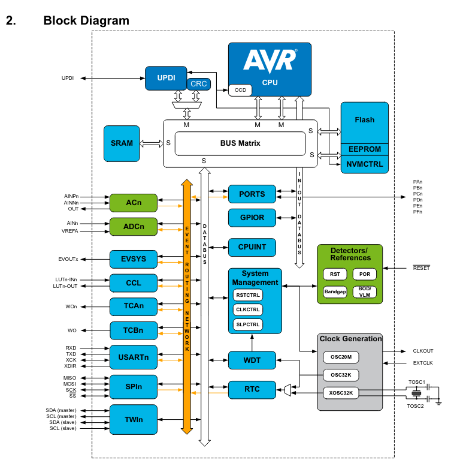
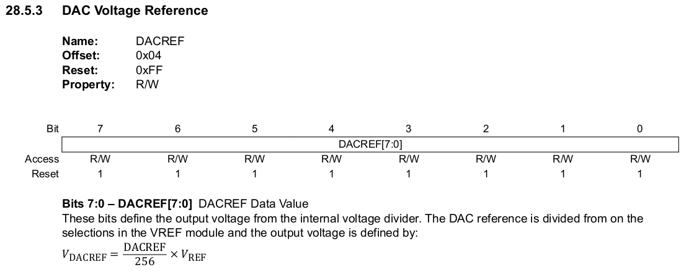
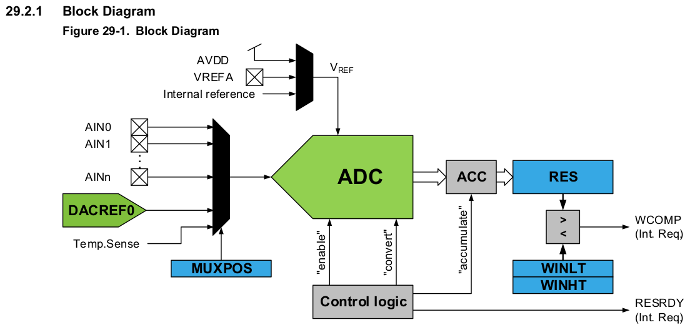

<!--
author:   Sebastian Zug, Karl Fessel & Andrè Dietrich
email:    sebastian.zug@informatik.tu-freiberg.de

version:  1.0.1
language: de
narrator: Deutsch Female

import:  https://raw.githubusercontent.com/liascript-templates/plantUML/master/README.md
         https://github.com/LiaTemplates/AVR8js/main/README.md
         https://github.com/LiaTemplates/Pyodide

icon: https://upload.wikimedia.org/wikipedia/commons/d/de/Logo_TU_Bergakademie_Freiberg.svg

-->


[](https://liascript.github.io/course/?https://github.com/TUBAF-IfI-LiaScript/VL_DigitaleSysteme/main/lectures/10_XMEGA_Abgrenzung.md#1)


# Abgrenzung des 4809

| Parameter                | Kursinformationen                                                                                                                                                                    |
| ------------------------ | ------------------------------------------------------------------------------------------------------------------------------------------------------------------------------------ |
| **Veranstaltung:**       | `Vorlesung Digitale Systeme`                                                                                                                                                      |
| **Semester**             | `Sommersemester 2021`                                                                                                                                                                |
| **Hochschule:**          | `Technische Universität Freiberg`                                                                                                                                                    |
| **Inhalte:**             | `Weitere Feature des 4809, Debuggingtechniken und Anwendungsbeispiel`                                                                                            |
| **Link auf den GitHub:** | [https://github.com/TUBAF-IfI-LiaScript/VL_DigitaleSysteme/blob/main/lectures/10_XMEGA_Abgrenzung.md](https://github.com/TUBAF-IfI-LiaScript/VL_DigitaleSysteme/blob/main/lectures/10_XMEGA_Abgrenzung.md) |
| **Autoren**              | @author                                                                                                                                                                              |


---

## Zugriff auf die Register und Speicherelemente

Die Adressierungen der Register und Konfigurationsbits für den ATmega erfolgte bisher individuell durch Nutzung der einzelnen Adressen und Positionen.

```c
#include <avr/io.h>

int main()
{
    /* Setzt das Richtungsregister des Ports A auf 0xff
       (alle Pins als Ausgang, vgl. Abschnitt Zugriff auf Ports): */
    DDRA = 0xff;

    /* Setzt PortA auf 0x03, Bit 0 und 1 "high", restliche "low": */
    PORTA = 0x03;

    // Setzen der Bits 0,1,2,3 und 4
    // Binär 00011111 = Hexadezimal 1F
    DDRB = 0x1F;    /* direkte Zuweisung - unübersichtlich */

    /* Ausführliche Schreibweise: identische Funktionalität, mehr Tipparbeit
       aber übersichtlicher und selbsterklärend: */
    DDRB = (1 << DDB0) | (1 << DDB1) | (1 << DDB2) | (1 << DDB3) | (1 << DDB4);

    while (1);
}
```

Dahinter stehen folgende Macros der `avrlibc`.

```c iom328p.h
#define PINC _SFR_IO8(0x06)
#define PINC0 0
```

```c  sfr_defs.h
#define __SFR_OFFSET 0x20
#define _SFR_IO8(io_addr) _MMIO_BYTE((io_addr) + __SFR_OFFSET)
#define _MMIO_BYTE(mem_addr) (*(volatile uint8_t *)(mem_addr))
```

In der Umsetzung für den 4809 geht man einen anderen Weg. Hier definieren wir
ein Set von `structs`, die auf den Speicher gemapt werden.


```c  sfr_defs.h
typedef struct ADC_struct {
   unsigned char CH0MUXCTRL;     // Channel 0 MUX Control
   unsigned char CH1MUXCTRL;     // Channel 1 MUX Control
   unsigned char CH2MUXCTRL;     // Channel 2 MUX Control
   unsigned char CH3MUXCTRL;     // Channel 3 MUX Control
   unsigned char CTRLA;          // Control Register A
   unsigned char CTRLB;          // Control Register B
   unsigned char REFCTRL;        // Reference Control
   unsigned char EVCTRL;         // Event Control
   WORDREGISTER(CH0RES);         // Channel 0 Result
   ....
} ADC_t;

#define WORDREGISTER(regname)  \
  union { \
    unsigned short regname; \
    struct { \
      unsigned char regname ## L; \
      unsigned char regname ## H; \
    };    \
}
```

| Postfix | Meaning               | Example           |
| ------- | --------------------- | ----------------- |
| `_gm`   | Group - Mask          | TC_CLKSEL_gm      |
| `_gc`   | Group - Configuration | TC_CLKSEL_DIV1_gc |
| `_bm`   | Bit   - Mask          | TC_CCAEN_bm       |
| `_bp`   | Bit   - Position      | TC_CCAEN_bp       |

[^AR1000]: Firma Microchip, AVR1000: Getting Started Writing C-code for XMEGA, [Link](http://ww1.microchip.com/downloads/en/AppNotes/doc8075.pdf)

## Weitere Hardwarefeatures des ATmega4809



### Analog Comparator


**Erweiterung gegenüber dem ATmega328**

1. Erweiterte Konfigurierbarkeit der Vergleichsspannung.

    mehrere wählbare Eingänge unabhängig vom ADC, einstellbare interne Referenz



2. Integration in das Eventsystem

    Der digitale Ausgang der AC steht als Quelle für das Ereignissystem zur Verfügung. Die Ereignisse von der AC sind unabhängig vom allen Takten im Gerät.

3. Definition eines Hysterese-Fensters

    Das Anlegen einer Eingangshysterese hilft, ein ständiges Umschalten des Ausgangs zu verhindern, wenn die verrauschten Eingangssignale nahe beieinander liegen.
    Die Eingangshysterese kann entweder deaktiviert werden oder eine von drei Stufen haben. Die Hysterese wird durch Beschreiben des Hysteresis Mode Select-Bitfeld (HYSMODE) im Register Control A (ACn.CTRLA).

<!-- data-type="none" -->
| lowpower mode | disabled           | enabled            |
| ------------- | ------------------ | ------------------ |
| off           | 0 - **0** - 10 mV    | 0 - **0** - 10 mV    |
| small         | 0 - **10** - 30 mV   | 0 - **10** - 30 mV   |
| medium        | 10 - **30** - 90 mV  | 5 - **25** - 50 mV   |
| large         | 20 - **60** - 150 mV | 12 - **50** - 190 mV |

    Die Festlegung des Ausgabesignal kann durch das `INVERT` Bit invertiert werden.

```ascii
              ^
              |
              ┤                  ╭─╮
              ┤~~~~~~~~~~~~~~~~~~│~│~~~~~~~~~~~~~~~~~~╭─╮~~~~
              ┤                  │ │  ╭╮ ╭╮ ╭╮   ╭╮  ╭╯ ╰─╮
              ┤  ╭╮          ╭─╮ │ │ ╭╯╰╮│╰─╯╰╮╭╮│╰──╯    │╭
Vergleichs-  v┼╭╮││╭╮ ╭╮╭╮   │ ╰─╯ ╰─╯  ││    ││││        ╰╯   Analoges Eingangs-
wert          ┤│││││╰╮│╰╯│   │          ╰╯    ╰╯╰╯             signal
              ┤╯╰╯╰╯ ╰╯  ╰─╮ │
              ┤~~~~~~~~~~~~│~│~~~~~~~~~~~~~~~~~~~~~~~~~~~~~~
              ┤            ╰─╯
              ┤------------+ +---+ +------------------+ +---
              ┤            | |   | |                  | |
              ┤            +-+   +-+                  +-+
              ┼───┴──────────┴──────────┴───────────┴────> t

```

[^Microchip4809]: Firma Microchip, ATmega4808/4809 Data Sheet, [Link](http://ww1.microchip.com/downloads/en/DeviceDoc/ATmega4808-4809-Data-Sheet-DS40002173A.pdf)

### Analog Converter

Die Analog-Digital-Wandler (ADC)-Peripherie des 4809 liefert 10-Bit-Ergebnisse. Dabei "vergleicht" der ADC entweder analoge Eingangspins, eine interne Spannungsreferenz oder die Ausgabe eines Temperatursensors mit entsprechenden Referenzspannungen `AVDD`, `VREFA` oder einer intern erzeugten Spannung. Der ADC ist mit einem analogen Multiplexer verbunden, der die Auswahl von mehreren unsymmetrischen Spannungseingängen ermöglicht. Der ADC unterstützt die Abtastung in Bursts, wobei eine konfigurierbare Anzahl von Wandlungsergebnissen zu einem einzigen ADC-Ergebnis akkumuliert wird (Sample Accumulation).

Das ADC-Eingangssignal wird durch eine Sample-and-Hold-Schaltung geführt, die sicherstellt, dass die Eingangsspannung zum ADC während der Abtastung auf einem konstanten Pegel gehalten wird.

Zur Überwachung des Eingangssignals steht eine Fenstervergleichsfunktion mit benutzerdefinierten Schwellenwerten zur Verfügung, die so konfiguriert werden kann, dass sie Interrupts für Messwerte unter, über, innerhalb oder außerhalb des Fensters auslöst, wobei nur minimaler Software-Eingriff erforderlich ist.



Der ADC kann zwei Interrupttypen auslösen `WCOMP`  Window Comparator Interrupt und `RESRDY` Result Ready Interrupt. Letztgenannter steht als Quelle im Event-System zur Verfühgung.

Der ADC benötigt für eine maximale Auflösung eine Eingangstaktfrequenz zwischen 50 kHz und 1,5 MHz. Wenn eine niedrigere Auflösung als 10 Bit genutzt wird (z.B durch kürzen des Ergebnisses auf 8 Bit), kann die Eingangstaktfrequenz zum ADC höher als 1,5 MHz sein, um eine höhere Abtastrate zu erhalten.

Die Initialisierung erfolgt in folgenden Schritten:

1. Konfigurieren Sie die Auflösung durch Beschreiben des Bits "Resolution Selection" (RESSEL) im Register "Control A (ADCn.CTRLA).
2. _Optional: Aktivieren Sie den Free-Running-Modus, indem Sie eine '1' in das Free-Running-Bit (FREERUN) in ADCn.CTRLA._
3. _Optional: Konfigurieren Sie die Anzahl der Samples, die pro Wandlung akkumuliert werden sollen, indem Sie die Sample Accumulation Number Select-Bits (SAMPNUM) im Register Control B (ADCn.CTRLB)._
4. Konfigurieren Sie eine Spannungsreferenz, indem Sie das Referenzauswahl-Bit (REFSEL) im Register Control C (ADCn.CTRLC). Die Voreinstellung ist die interne Spannungsreferenz des Geräts (VREF, wie dort konfiguriert).
5. Konfigurieren Sie den CLK_ADC durch Beschreiben des Bitfeldes Prescaler (PRESC) im Register Control C (ADCn.CTRLC).
6. 6. Konfigurieren Sie einen Eingang durch Beschreiben des Bitfeldes MUXPOS im MUXPOS-Register (ADCn.MUXPOS).
7. _Optional: Aktivieren Sie den Start-Event-Eingang, indem Sie eine '1' in das Start-Event-Input-Bit (STARTEI) im Event Control Register (ADCn.EVCTRL) schreiben. Konfigurieren Sie das Ereignissystem entsprechend._
8. Aktivieren Sie den ADC, indem Sie eine '1' in das ENABLE-Bit in ADCn.CTRLA schreiben.


Was sind die Änderungen gegenüber dem ATmega328?

* Die größere Zahl von internen Referenzspannungen bietet eine deutliche bessere Anpassungsfähigkeit an verschiedene Ausgabespannungshorizonte
* Die Definition von Wertefenstern ermöglicht eine spezifischere Auswertung in Hardware (siehe `CTRLE` [^Microchip4809] Seite 409). Interrupts können ausgelöst werden, wenn das Wandlungsergebnis innerhalb, außerhalb der beiden Schranken `WINLT` oder `WINHT` liegt.
* Mit der Möglichkeit der Akkumulation von Samples kann ohne zusätzliche Implementierung eine Glättung der Werte vorgenommen werden ([^Microchip4809] Seite 406).

Eine gute Dokumentation der Verwendung der ADC Konfiguration liefert [Tutorial](https://onlinedocs.microchip.com/pr/GUID-E551BCD6-7E40-4DB9-BF2D-5E7E95B90AB3-en-US-3/index.html?GUID-590AA50F-CE8E-45E8-B96A-8B491F7FCCE1).

[^Microchip4809]: Firma Microchip, ATmega4808/4809 Data Sheet, [Link](http://ww1.microchip.com/downloads/en/DeviceDoc/ATmega4808-4809-Data-Sheet-DS40002173A.pdf)

## Anwendungsfall

> Auslesen eines Potentiometers am Analog Pin des Controllers unter Ausnutzung des Akkumulators

## Debugging

Debugging für Speicher und leistungsbeschränkte Systeme (unter Echtzeitbedingungen) stellt andere Herausforderungen als konventionelle Analysemethoden. Gleichzeitig sind wir mit kniffligen Bugs konfrontiert mit _Race Conditions_, _Stack Overflows_ oder _Priority Inversions_.

* printf-Debugging bläht den Code auf, weil die zugehörigen Implementierungen integriert werden müssen.
* Debugging verändert das Laufzeitverhalten, entsprechend ist es möglich, dass die Ausführung des entsprechenden Codes durch den Overhead für die Analyse maskiert wird.
* auf dem Gerät steht gar nicht genügend Speicher zur Verfügung um längere Tracing-Aufzeichnungen umzusetzen

Lösungsansätze:

1. Statische Codenanalyse

    * *Assembly Analysis* - Hier gilt es insbesondere den Code auf unterschiedlichen Optimierungsstufen des Compiler zu vergleichen.

2. Testen
    * *Verwendung von Simulationen* - Damit haben wir die Möglichkeit "von außen" den Status der Abarbeitung zu überwachen. Allerdings sind diese nur unter Einschränkungen geeignet, die Hardware-spezifischen Fehler zu identifizieren.
    * *_Bed of Nails_* - Über eine elektrische Verbindung werden werden Daten "eingespielt" und die Reaktion des Systems evaluiert.
!?[alt-text](https://www.youtube.com/watch?v=ReB51Hxvmo8)

    * *_Boundary Scans_*

<!--
style="width: 80%; min-width: 420px; max-width: 720px;"
-->
```ascii
Serial
Data in                                           <--------+ Serial Data
---------+             +---------------------+             | out
         |             |                     |             |
         v             |                     v             |
       +-+-------------+-+                 +-+-------------+-+
       | |   CPU I     | |                 | |   CPU II    | |
       | |  +-------+  | |                 | |  +-------+  | |
     ▬-+-□--| Core  |--□-+-▬      +------▬-+-□--| Core  |--□-+-▬
       | |  | Logic |  | |        |        | |  | Logic |  | |
     ▬-+-□--|       |--□-+-▬------+      ▬-+-□--|       |--□-+-▬
       | |  |       |  | |        zu       | |  |       |  | |
     ▬-+-□--|       |--□-+-▬   testende  ▬-+-□--|       |--□-+-▬
       | |  +-------+  | |    Verbindung   | |  +-------+  | |
       | +-------------+ |                 | +-------------+ |
       +-----------------+                 +-----------------+

````

> **Merke:** Die von uns betrachteten Controller decken diese Möglichkeit nicht ab!

Ablauf im Testfall:

+ Erzeugung der Testmuster,
+ Anwendung der Testmuster,
+ Beobachtung des Systemverhaltens und ggf.
+ Vergleich der Ergebnisse

### JTAG

Joint Test Action Group (kurz JTAG) ist ein häufig verwendetes Synonym für das von der Arbeitsgruppe definierte Verfahren für den Boundary Scan Test nach IEEE 1149.1. Durch Hinzufügen weiterer Verfahren (1149.1–1149.8) sind die Begriffe nicht mehr synonym, während die Beschreibungssprache von der IEEE-Arbeitsgruppe mit Boundary Scan Description Language den ursprünglichen Namen beibehielt.


| Bezeichnung            | Bedeutung                                            |
| ---------------------- | ---------------------------------------------------- |
| Test Data Input (TDI)  | Serieller Eingang der Schieberegister.               |
| Test Data Output (TDO) | Serieller Ausgang der Schieberegister.               |
| Test Clock (TCK).      | Das Taktsignal für die gesamte Testlogik.            |
| Test Mode Select (TMS) | Diese steuert die State Machine des TAP-Controllers. |
| Test Reset (TRST)      | Reset der Testlogik (optional)                       |


Der TAP-Controller ist ein von TCK getakteter und von der TMS-Leitung gesteuerter Zustandsautomat. Die TMS-Leitung bestimmt dabei, in welchen Folgezustand beim nächsten Takt gesprungen wird. Der TAP-Controller hat sechs stabile Zustände, das heißt Zustände, in denen mehrere Takte lang verblieben werden kann. Diese sechs Zustände sind „Test Logic Reset“, „Run Test / Idle“, „Shift-DR“ und „Shift-IR“ sowie „Pause-DR“ und „Pause-IR“. Im Zustand „Test Logic Reset“ wird die Testlogik zurückgesetzt, „Run Test / Idle“ wird als Ruhezustand oder für Wartezeiten benutzt. Die beiden „Shift“-Zustände schieben jeweils das DR- oder IR-Schieberegister. Die beiden „Pause“-Zustände dienen der Unterbrechung von Schiebeoperationen. Aus allen anderen Zuständen wird beim folgenden Takt in einen anderen Zustand gesprungen. Beim Durchlaufen werden jeweils bestimmte Steuerfunktionen ausgelöst.


> Und auf den 8-Bit Atmel Controllern?

Die JTAG Funktionalität wird nur für einzelne Controllerfamilien unterstützt. Eine Variante sind die "größeren" ATmega1280 und ATmega2650.

Auszug aus dem Handbuch

```
JTAG (IEEE std. 1149.1 Compliant) Interface with access to:
+ all Internal Peripheral Units
+ Internal and External RAM
+ Internal Register File
+ Program Counter
+ EEPROM and Flash Memories

On-chip Debug Support for Break Conditions, Including
+ AVR Break Instruction
+ Break on Change of Program Memory Flow
+ Single Step Break
+ Program Memory Breakpoints on Single Address or Address Range
+ Data Memory Breakpoints on Single Address or Address Range
+ Programming of Flash, EEPROM, Fuses, and Lock Bits through the JTAG Interface
+ On-chip Debugging Supported by AVR Studio
```


> **Merke:** Für die Verwendung ist ein eigener Programmer erforderlich.

> **Merke:**  JTAG ist im Auslieferungszustand des Arduino Mega ausgeschaltet!

[^JTAG_Chain]: Wikimedia, Author Vindicator, _ JTAG chain for programmable devices_, https://commons.wikimedia.org/wiki/File:Jtag_chain.svg

[^JTAG_Chain]: Wikimedia, Author Rudolph H, _Zustandsautomat eines JTAG TAP-Controllers. Die Einsen und Nullen geben den Zustand der TMS-Leitung an, dieser bestimmt, in welchen State bei der nächsten TCK gesprungen wird._, https://commons.wikimedia.org/wiki/File:JTAG_TAP_Controller_State_Diagram.svg

[^JTAG_Schema]: Wikimedia, Author Rudolph H, _Diagramm eines JTAG Test Access Ports mit den üblicherweise vorhandenen Datenregistern._, https://commons.wikimedia.org/wiki/File:JTAG_Register.svg

[^ATmega2560]: Firma Microchip, Handbuch ATmega640, ATmega1280 .... http://ww1.microchip.com/downloads/en/DeviceDoc/Atmel-2549-8-bit-AVR-Microcontroller-ATmega640-1280-1281-2560-2561_datasheet.pdf

### debugWire (ATmega328)

debugWIRE ist ein serielles Kommunikationsprotokoll, das als einfache Alternative zu JTAG eingeführt wurde und bei Prozessoren mit begrenzten Ressourcen – speziell wenigen Anschlusspins – eingesetzt wird. debugWIRE erlaubt vollen Lese- und Schreibzugriff auf den Speicher und die Überwachung des Programmflusses. Dabei können nur die Aktionen durchgeführt werden, die auch bei normalem Programmablauf möglich sind. Breakpoints werden durch Einfügen von Break-Opcodes (0x9598) in das Programm vor der Übertragung auf den Microcontroller gesetzt.

debugWIRE benutzt serielle Kommunikation über eine Ein-Draht-Leitung mit Open-Drain-Ankopplung. Die Standard-Taktrate ist 1/128 des Prozessortaktes. Eingeleitet wird die Kommunikation durch Senden des Break-Zustandes (alle Bits 0), als Antwort sendet der zu testende Prozessor das Byte 0x55, das aus abwechselnd Null- und Eins-Pegeln besteht. Dies erlaubt dem Debugger eine einfache Identifizierung der Taktrate.


> **Merke:** Der debugWIRE-Kommunikationspin liegt physikalisch auf demselben Pin wie der externe Reset (RESET). Eine externe Reset-Quelle wird daher nicht unterstützt, wenn das debugWIRE aktiviert ist!

[^ATmega328]: Firma Microchip, ATmega328P Data sheet, http://http://ww1.microchip.com/downloads/en/DeviceDoc/Atmel-7810-Automotive-Microcontrollers-ATmega328P_Datasheet.pdf

### UPDI (ATmega4809)

Das Unified Program and Debug Interface (UPDI) ist eine proprietäre Schnittstelle zur externen Programmierung und zum On-Chip Debugging eines Gerätes. Das UPDI unterstützt die Programmierung von nichtflüchtigem Speicher (NVM), FLASH, EEPROM, Fuses, Lockbits. Darüber hinaus kann das UPDI auf den gesamten I/O- und Datenbereich des Bausteins zugreifen.

Die Programmierung und das Debugging erfolgen über das UPDI Physical Interface (UPDI PHY), das ist eine Ein-Draht-UART-basierte Halbduplex-Schnittstelle, die einen eigenen Pin für den Datenempfang und -versand verwendet. Die Taktung des UPDI PHY erfolgt durch den internen Oszillator. UPDI bietet zwei Zugriffsmöglichkeiten zum einen über eine UPDI-Zugriffsschicht auf die Busmatrix der MCU zum anderen auf das Asynchronous System Interface.

Der Zugriff auf die Busmatrix, ermöglicht den Zugriff auf Systemblöcke wie Speicher, NVM und Peripheriegeräte über deren Speicherabbildungen (wie es auch der laufende Code kann).

Das Asynchronous System Interface (ASI) bietet direkten Schnittstellenzugriff auf On-Chip-Debugging (OCD), NVM und System-Management-Funktionen. Dadurch erhält der Debugger direkten Zugriff auf Systeminformationen, ohne dass ein Bus Zugriff erforderlich ist.


> Analysieren Sie das Instruktionsset des UPDI Protokolls im Handbuch!

[^Microchip4809]: Firma Microchip, ATmega4808/4809 Data Sheet, [Link](http://ww1.microchip.com/downloads/en/DeviceDoc/ATmega4808-4809-Data-Sheet-DS40002173A.pdf)

### Nutzung

**Externer Programmer / Debugger**

Es exisiteren verschiedensten Open-Source Projekten für die Implementierung von Programmern für die ATmega Familie auf der Basis

+ einer dedizierten Hardware [ISP Programmer](https://www.olimex.com/Products/AVR/Programmers/AVR-ISP-MK2/open-source-hardware) oder
+ über ein Arduino Board [ArduinoISP](https://www.arduino.cc/en/Tutorial/BuiltInExamples/ArduinoISP)

Dabei wird jeweils die SPI Schnittstelle für die Programmierung genutzt.

Das eigentliche Debugging bleibt bei den ältern ATmega MCU mit Blick auf externe JTAG Debugger properitären Lösungen vorbehalten. Ein Beispiel ist der Atmel ICE mit folgenden Features:

+ Programming and on-chip debugging of all AVR 32-bit MCUs on both JTAG and aWire interfaces
+ Programming and on-chip debugging of all AVR XMEGA family devices on both JTAG and PDI 2-wire interfaces
+ JTAG and SPI programming and debugging of all AVR 8-bit MCUs with OCD support on either JTAG or debugWIRE interfaces
+ Programming and debugging of all SAM ARM Cortex-M based MCUs on both SWD and JTAG interfaces
+ Programming of all tinyAVR 8-bit MCUs with support for the TPI interface
+ Programming and debugging of all AVR 8-bit MCUs with UPDI

Das DebugWire-Protokoll wurde zum Teil reverse-engineered [git](https://github.com/dcwbrown/dwire-debug) [protokoll](http://www.ruemohr.org/docs/debugwire.html)

Auch für das UPDI-Protokoll gibt es Nachbauten [git](https://github.com/ElTangas/jtag2updi) [gdb-adapter](https://github.com/stemnic/pyAVRdbg)


**Integrierte Programmer / Debugger**

Für unseren konkreten Controller ist der UPDI Anschluss unmittelbar mit dem Debug-Controller MEDBG1 verbunden [Link](http://ww1.microchip.com/downloads/en/devicedoc/atmel-42096-microcontrollers-embedded-debugger_user-guide.pdf). Beachten Sie, dass sie mit dem Wechsel des Jumpers zwischen dem Hauptcontroller und dem Kommmunikationschip in Bezug auf die UPDI Schnittstelle wechseln können.

Die SPI basierte Programmierung kann mit den genannten Debuggern über den 2x3 Pfostenstecker erfolgen.

## Beispielprojekte mit dem AVR Studio

Grundfunktionalitäten für das Debugging und die Verwendung des Atmel Start Konfigurationswerkzeuges.

!?[alt-text](https://www.youtube.com/watch?v=j78ggh5wtgM)

### Serielle Ausgaben in der IDE


[^AVRStudioVisualizer]: Firma Microchip, Data Visualizer Software User's Guide, [Link](https://www.microchip.com/content/dam/mchp/documents/data-visualizer/40001903B.pdf)

### Exkurs: Curiostiy Nano

Einen Mittelweg geht das Curiosity Nano Board, das einen erweiterten Debugger integriert. Die Plattform verfügt über einen virtuellen COM-Port (CDC) für die serielle Kommunikation mit einem Host-PC und ein Data Gateway Interface (DGI) GPIO.
Die DGI-Schnittstelle unterstütz die Verwendung von 2 Logik-Analysator-Kanälen zur Codeinstrumentierung. Der virtuelle COM-Port ist mit einem UART auf dem ATmega4809 verbunden und bietet eine einfache Möglichkeit, mit der Zielanwendung über eine Terminal-Software zu kommunizieren. Dies wurde bereits mit dem Arduino Uno Wifi demonstriert.


Damit lassen sich nun Debugging Prozesse neben dem schrittweisen durcharbeiten per serieller Schnittstelle auch unmittelbar grafisch darstellen.


Zum Vergleich, der Arduino Wifi berücksichtigt diese Möglichkeit des Debuggings nicht und bildet nur die UPDI und die Serielle Schnittstelle ab.


[^Arduino_UNO_WIFI]: Arduino, Documentation Arduino Uno Wifi, [Link](https://ww1.microchip.com/downloads/en/DeviceDoc/ATmega4809-Curiosity-Nano-HW-UG-DS50002804A.pdf)

[^MicrochipCuriosity]: Firma Microchip, ATmega4809 Curiosity Nano Hardware User Guide, [Link](https://ww1.microchip.com/downloads/en/DeviceDoc/ATmega4809-Curiosity-Nano-HW-UG-DS50002804A.pdf)

### Beispielanwendung

... folgt in der nächsten Übung

## Aufgaben

- [ ] Evaluieren Sie den Laufzeitvorteil der Mittelwertbildung mit dem `Accumulator Mode` gegenüber einer Softwarelösung. Welche Schritte werden eingespart?
